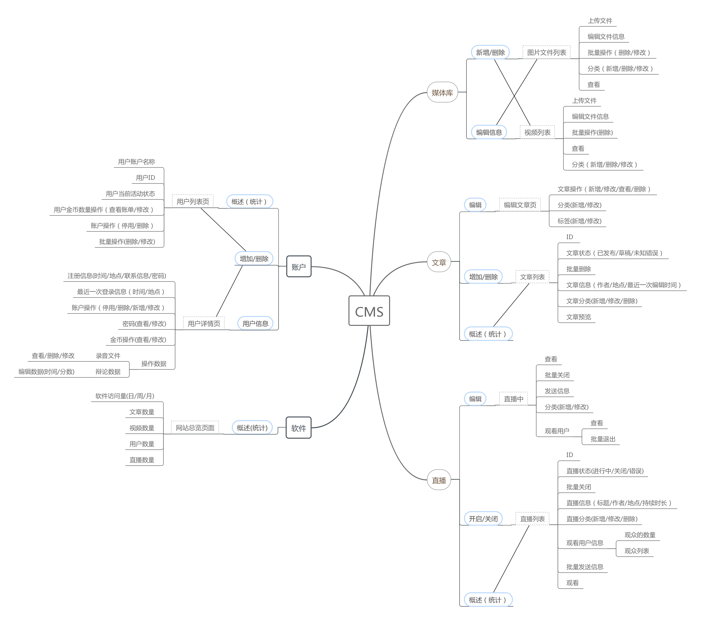
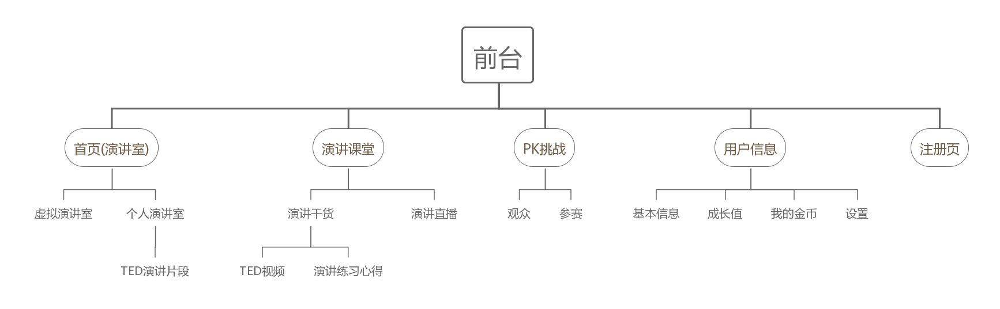
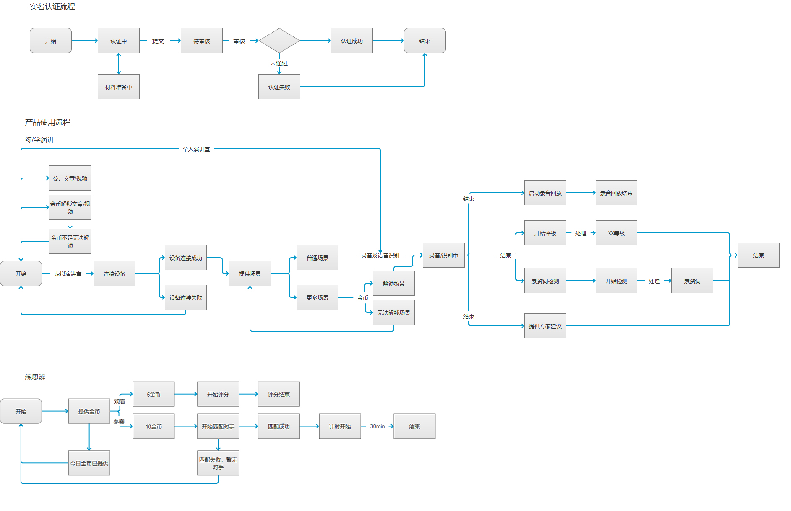

# 1.产品框架图：

## 主要功能模块
### 1. 前台内容显示模块：

### 2. 后台内容显示模块：

# 2.使用流程图：
  

# 3.角色权限框架图
* [用户](https://bingxin70aa.github.io/T-talk_role_framework/#g=1&p=%E9%A6%96%E9%A1%B5)
* [管理员](https://bingxin70aa.github.io/T-talk_role_framework/#g=1&p=%E9%A6%96%E9%A1%B5_1)

## 1. 用户
### 首页
### 内容管理
* 文章列表：演讲视频经验分享（干货）
* 编辑列表：图、标题等

## 2. 管理员
### 首页
### 历史统计
今日浏览量、用户新增量、今日访问量等
### 用户管理
* 用户管理：用户类型、用户规模趋势等
* 用户详情：头像、id等基本信息
### 内容管理
* 文章列表：演讲视频经验分享（干货）
* 编辑列表：图、标题等
* 媒体库：图片、演讲视频
* 直播列表:演讲直播列表

