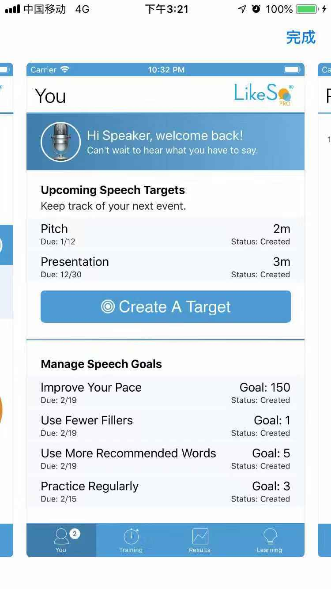
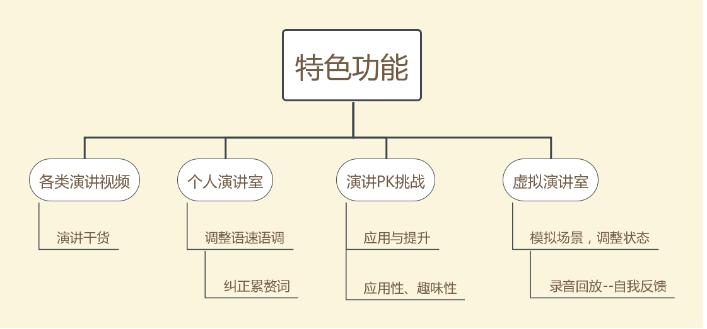
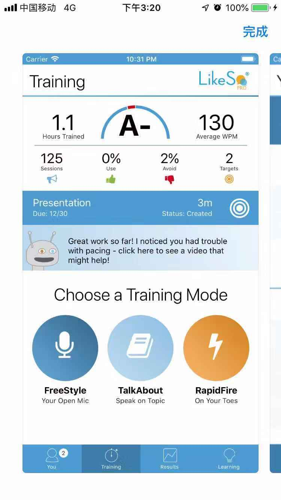
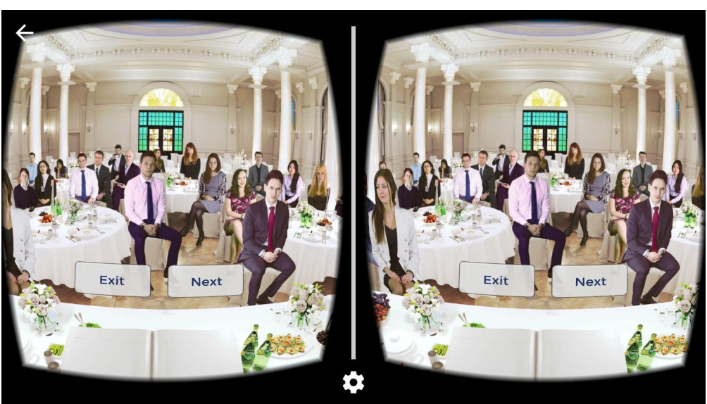
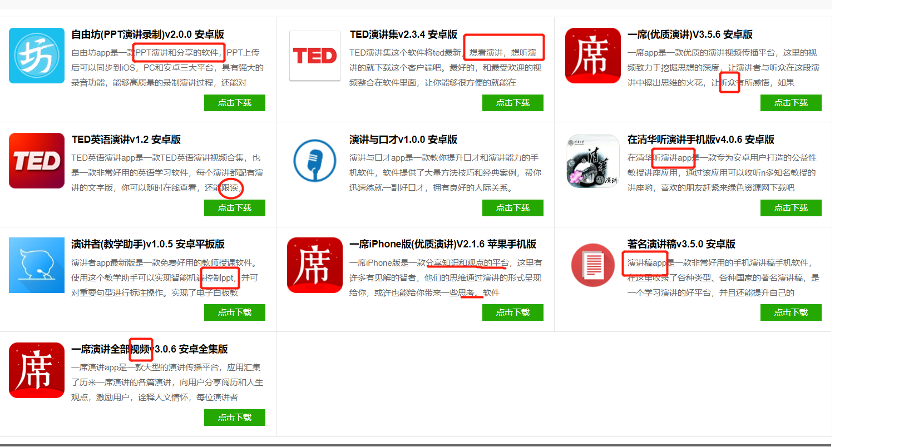

日期 | 内容 
---|---
2018.12.12 | 展示MRD,招募人员 
2018.12.12 | 增删功能，修改图片大小 
2018.12.16 | 修改用户场景 

# 一、需求概述
##  1、概述
### 1.1背景
-  当今随着人际关系和社会关系越来越复杂化，演讲已经成为市场经济环境下一种沟通和交流的手段，不管是商业上还是日常生活中都会应用到。可见提高演讲技能的重要性。

### 1.2目标
-  做一个提高演讲能力的APP。它私人演讲教练的角色，可以帮助言语恐惧症患者或者不善表达者训练在公众面前演讲的能力，甚至能达到辩论水平。好的演讲与口才能力是练出来的！

### 1.3阶段性计划：
阶段 | 计划内容
---|---
产品雏形 | 把产品架构大致列出
成员组建 | 招兵买马，招募人员协作完成期末项目
功能完善 | 小组内讨论，功能的完善及小组分工
原型制作 | 需要2个审美好的人协作完成，这部分最重要
产品实现 | 需要2个技术人员人协作完成，不用全部功能做出来
包装与推广 | 需要2个口才与文案好的人协作完成

# 二、市场概述

## 1.目标市场：
移动端用户（便携互联网技术的发展）、语言沟通类市场（英语流利说）、演讲练习APP市场

## 2.目标用户：
不善表达者、想提高演讲水平者、恐语症患者

## 3.显著化特征：
### 1.优化界面（市面的界面比较简洁，色彩单一，如：likeso）

### 2.特色功能：

#### 可以看各类演讲视频页面。多看看不同的别人怎么讲。

#### 个人演讲室（类似个人k房、英语流利说），提供一些TED演讲片段。可以在里面模仿演讲，锻炼语调语速。最后会评级。有录音和回放功能；有专家根据语音语调、累赘词语，提出建议。多练

 

#### 演讲PK（类似音遇app），游戏化形式，提供一个热门辩题，进入与陌生人/朋友辩论。赢的进入挑战赛，加积分。

#### 个人虚拟演讲室，可以选择模拟的演讲场景，训练即将来临的演讲，演讲训练通过使用语音识别技术来训练用户，避免习惯性口头语。习惯性口头语通常是“例如”、“这样”、“你知道”、“总之”等这样的词，当使用太多的时候，演讲的可信度会降低，削弱演讲的影响力，分散听众的注意力，并招致不必要的评判。有录音回放功能，可能需要佩戴类似vr眼镜？（解决依赖线上交流在一定程度上削弱了我们在面对面的真实对话中的技能问题）

## 4.市场特征
### 如图所示：目前市面上的演讲APP以看演讲、听演讲，还有PPT演讲稿观点分享较多。真正让演讲者去练习的APP较少。

### 4.1市场问题
1. 依赖线上交流在一定程度上削弱了我们在面对面的真实对话中的技能。
2. 高级技术投入太多，成本高。市面上的演讲APP都是只有一两个主要功能为主。
3. 界面都比较单一，不够趣味性。

### 4.2市场机会

1. 加入VR技术，模拟演讲场景
2. 利用人工智能语音识别技术，帮助用户纠正口头语
3. 集成式APP功能更丰富，界面更美观
4. 演讲练习APP国内市场未饱和

###  4.3市场趋势

1. 随着现在智能手机的普及，手机APP具有便携性的特点。
2. 人工智能技术的应用越来越广泛

###  4.4市场壁垒
1. 年轻壁垒。市场未饱和，品牌体验不深，用户引进难。
2. 资金壁垒。技术投入及市场推广需要大量资金支持。
3. 技术壁垒。如人工智能、搜索这些需要高精尖技术人才，才能实现的。
4. 垄断壁垒。例如一些演讲视频需要翻墙或者有版权问题。

###  2.5市场紧迫性
目前演讲练习APP市场未饱和，应当抓住机遇，迎接挑战，迎难而上。

# 三、用户需求分析
1. 随着社会的发展，个人表达能力与演讲水平越来越重要，好的演讲能更好地展示你的能力，体现你的思考，而许多人因为性格、环境等各种因素的影响，害怕演讲，这是不自信的表现，也不利于自身发展。
2. 随着人工智能时代的到来，机器能做的事情越来越多了。而人的思考能力机器无法取代的，只有不断地锻炼思维，才不至于被社会淘汰。

* 痛点：
1. 演讲紧张，没有预备心理
2. 演讲逻辑不清晰
3. 演讲口头语太多，显得不自信
4. 演讲没有气场

## 3.1用户类型细分
1. 不善表达者
2. 想提高自己的演讲能力者
3. 上场会怯场者
4. 恐语症患者

### 3.2用户场景

场景 | 做法
---|---
演讲总有一些累赘词语 | 打开个人演讲室，模拟ted演讲片段可以在公共场合/独处的场合联习
第二天需要演讲十分紧张 | 打开模拟演播厅，选择对应场景进行训练，做好心理预备
验证自己口才、思考能力 | 打开演讲PK页面，与陌生人/朋友辩论
演讲内容不够，表现力不够 | 打开演讲课堂页面，积累素材和演讲技巧

# 四、竞品分析
## 4.1直接竞品
产品名称 | 优点 |不足
---|---|---
likeso | 有评级、录音、纠错功能|界面过于简单，可能让用户依赖线上演讲
虚拟演讲APP | 模拟演讲场景|功能相对单一需要VR眼镜辅助

4.2间接竞品

产品名称 | 优点|
---|---
英语流利说 | 摘选英语段落，让你录音，模仿练习口语
唱吧 | 创建个人k房，个人练歌，歌曲评级

# 五、结论
该产品还是有一定的市场潜力和机会，也符合社会的发展应用需求，如果你感兴趣就加入我的队伍吧！
