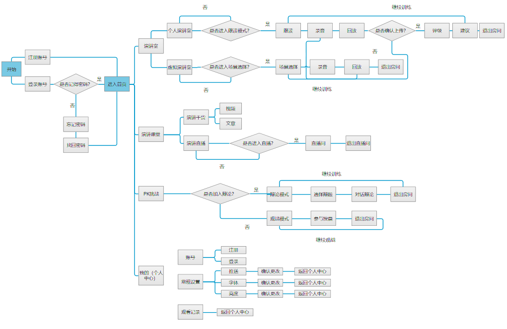

# 1.前端信息设计：
## 产品构架图：
* 全局功能结构：

* 页面结构图：

## APP使用流程图：

## 用户体系构架图：

用户类型 | 权限/奖励 | 对应页面/用户行为
---|---|---
明星、名人 |给予身份认证标识、获得特权 |个人信息页面
专业大牛、演讲家 |给予身份认证标识、获得特权 |个人信息页面
贡献用户 |等级积分、用户头衔、打赏奖励等 |演讲课堂页面的干货搬运/编写/上传视频
活跃用户 |虚拟货币（T币）奖励、等级积分、用户头衔等 | 签到任务、当辩论PK赛观众、参赛者、评论
普通用户 |虚拟货币、等级积分等|练习个人演讲相关页面

# 2.核心功能价值：
## 产品核心：
提供一个平台给用户练习演讲，让用户学演讲、练演讲、练思辨多方面，通过可以刻意练习提高演讲能力。

## 功能如何体现产品核心立足点：

页面 | 重要性 | 可行性| 急迫性
---|---|---|---
 模拟演讲室|预备演讲，熟悉演讲环境|需要VR技术支持，辅VR设备|一般，市面上有类似功能
 演讲PK|提供辩题与人pk，锻炼思维逻辑|提供平台锻炼思考|重要，市面上没有这样的APP
个人演讲室|提供TED演讲片段跟读|语音识别纠正口头语学习别人如何讲|重要，市面上还没有这样的APP
 演讲视频干货观看|学习别人演讲技巧|部分视频可能有版权问题|一般，市面上有类似功能
 
## 产品特色功能：

## 加值：使用游戏化思维：
1. 使用pk的形式去应用练习思辨能力，提高演讲的逻辑性
2. 用金币机制带给用户奖励，提高用户积极性
3. 金币同时可以应用在其他页面，增加页面关联性和产品逻辑性，产品的一致性
4. 辩论PK挑战，想采用升级做任务、获取金币的形式，增加用户体验和用户粘度

